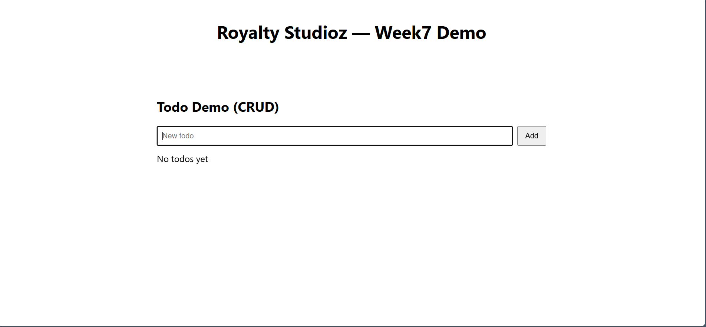

# Royalty Studioz — Week 7: Deployment & DevOps

## What this project contains
- A minimal MERN stack example for Week 7 assignment.
- Backend (server/) — Express + Mongoose with a Todo CRUD API.
- Frontend (client/) — React app with a Todo UI.
- GitHub Actions CI workflows for backend & frontend.

## Local setup
1. Clone repo.
2. Create .env files:
   - server/.env:
     PORT=5000
     MONGO_URI=<your-atlas-uri>
   - client/.env:
     REACT_APP_API_URL=http://localhost:5000
3. Start backend:
   cd server && npm run dev
4. Start frontend:
   cd client && npm start

## API
- GET /api/ping → { message: "pong" }
- GET /api/todos → list todos
- POST /api/todos → create { title }
- PATCH /api/todos/:id/toggle → toggle done
- DELETE /api/todos/:id → delete

## Deployment (suggested)
- Backend: Render / Railway / Heroku — set MONGO_URI in env on the platform.
- Frontend: Vercel / Netlify — set REACT_APP_API_URL to your backend URL.
- CI: GitHub Actions included.

## Submission checklist
- [ ] Code pushed to GitHub Classroom repo (main)
- [ ] CI workflows run & screenshot included
- [ ] https://nimble-bonbon-da085c.netlify.app/
- [ ] README contains deployed URLs and instructions
- 

